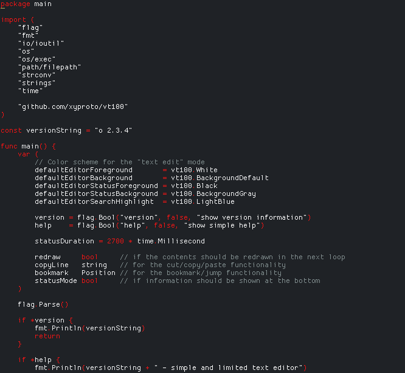

# o   

`o` is yet another editor. It's limited to the VT100 standard, and can be used for programming in Go or C++. It has many limitations, but is small and fast. It's a good fit for writing git commit messages, using `EDITOR=o git commit`.

* Compiles with either `go` or `gccgo`.
* Tested with `st`, `urxvt` and `xfce4-terminal`.
* Tested on Arch Linux and FreeBSD.

For a more feature complete editor that is also written in Go, check out [micro](https://github.com/zyedidia/micro).

<!--## Screenshot

-->

## Quick start

You can install `o` with Go 1.10 or later:

    go get -u github.com/xyproto/o

## Features and limitations

* Has syntax highlighting for Go and C++ code.
* Loads faster than both `vim` and `emacs`. It feels instant.
* Can format Go or C++ code, just press `ctrl-o`. This uses either `goimports` (`go get golang.org/x/tools/cmd/goimports`) or `clang-format`.
* Never asks before saving or quitting. Be careful!
* Will strip trailing whitespace whenever it can.
* Must be given a filename at start.
* Smart indentation.
* `Home` and `End` are not detected by the key handler. `ctrl-a` and `ctrl-e` works, though.
* Requires `/dev/tty` to be available.
* Copy, cut and paste is only for one line at a time. `xclip` must be installed if the system clipboard is to be used.
* May take a line number as the second argument, with an optional `+` prefix.
* The text will be red if a loaded file is read-only.
* The terminal needs to be resized to show the second half of lines that are longer than the terminal width.
* If the filename is `COMMIT_EDITMSG`, the look and feel will be adjusted for git commit messages.
* Supports `UTF-8`.
* Respects the `NO_COLOR` environment variable.
* Only UNIX-style line endings are supported (`\n`).

## Known bugs

* Files with lines longer than the terminal width are not handled gracefully.
* Word wrap sometimes break a word at the wrong position when typing.

## Spinner

When loading large files, an animated spinner will appear. The loading operation can be stopped at any time by pressing `esc`, `q` or `ctrl-q`.

## Hotkeys

* `ctrl-q` - Quit
* `ctrl-s` - Save
* `ctrl-o` - Format the current file using `goimport` or `clang-format`, depending on the file extension.
* `ctrl-a` - Go to start of line, then start of text on the same line, then the previous paragraph.
* `ctrl-e` - Go to end of line, then next paragraph.
* `ctrl-p` - Scroll up 10 lines
* `ctrl-n` - Scroll down 10 lines, or go to the next match if a search is active
* `ctrl-k` - Delete characters to the end of the line, then delete the line
* `ctrl-g` - Toggle a status line at the bottom for displaying: filename, line, column, unicode number and word count
* `ctrl-d` - Delete a single character
* `ctrl-t` - Toggle syntax highlighting
* `ctrl-w` - Toggle between "text" and "draw mode" (for ASCII graphics)
* `ctrl-x` - Cut the current line
* `ctrl-c` - Copy the current line
* `ctrl-v` - Paste the current line
* `ctrl-b` - Bookmark the current line
* `ctrl-j` - Jump to the bookmark
* `ctrl-u` - Undo (`ctrl-z` is also possible, but may background the application)
* `ctrl-l` - Jump to a specific line number
* `ctrl-f` - Search for a string.
* `esc` - Redraw the screen and clear the last search.
* `ctrl-space` - Build
* `ctrl-\` - Toggle single-line comments
* `ctrl-r` - Render the current text to a PDF document.

## Size

* The `o` executable is only **541k** when built with GCC 9.2 (for 64-bit Linux).
* This isn't as small as [e3](https://sites.google.com/site/e3editor/), an editor written in assembly (which is **234k**), but it's resonably lean.

    go build -gccgoflags '-Os -s'

It's around **3M** when building with Go 1.13 and no particular build flags are given, which is also reasonable.

## Jumping to a specific line when opening a file

These four ways of opening `file.txt` at line `7` are supported:

* `o file.txt 7`
* `o file.txt +7`
* `o file.txt:7`
* `o file.txt+7`

This also means that filenames containing `+` or `:` are not supported, if followed by a number. Opening files with the `c++` extension works, if you should want that.

## The very first kepyress

If the very first keypress after starting `o` is `O`, `G` or `/`, it will trigger the following vi-compatible behavior:

* `O` - if followed by an uppercase letter, ignore the initial `O`
* `/` - enter search-mode (same as when pressing `ctrl-f`)
* `G` - go to the end of the file

The reason for adding these is to make using `o` easier to use for long-time vi/vim/neovim users.

## General info

* Version: 2.12.1
* License: 3-clause BSD
* Author: Alexander F. Rødseth &lt;xyproto@archlinux.org&gt;
